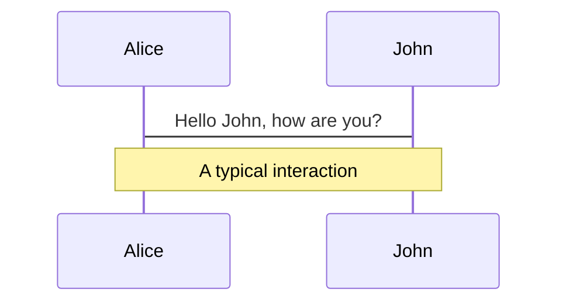
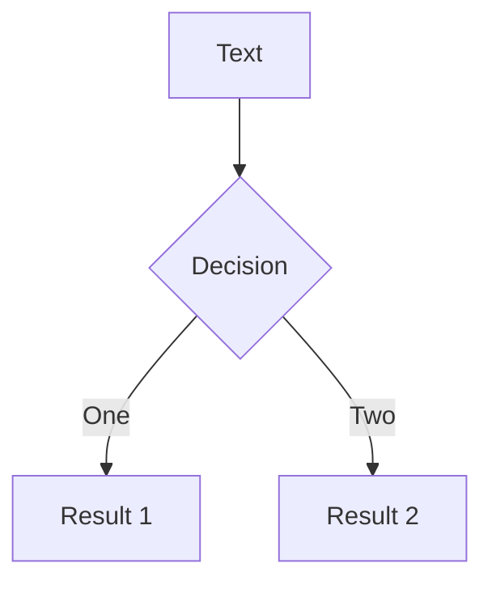
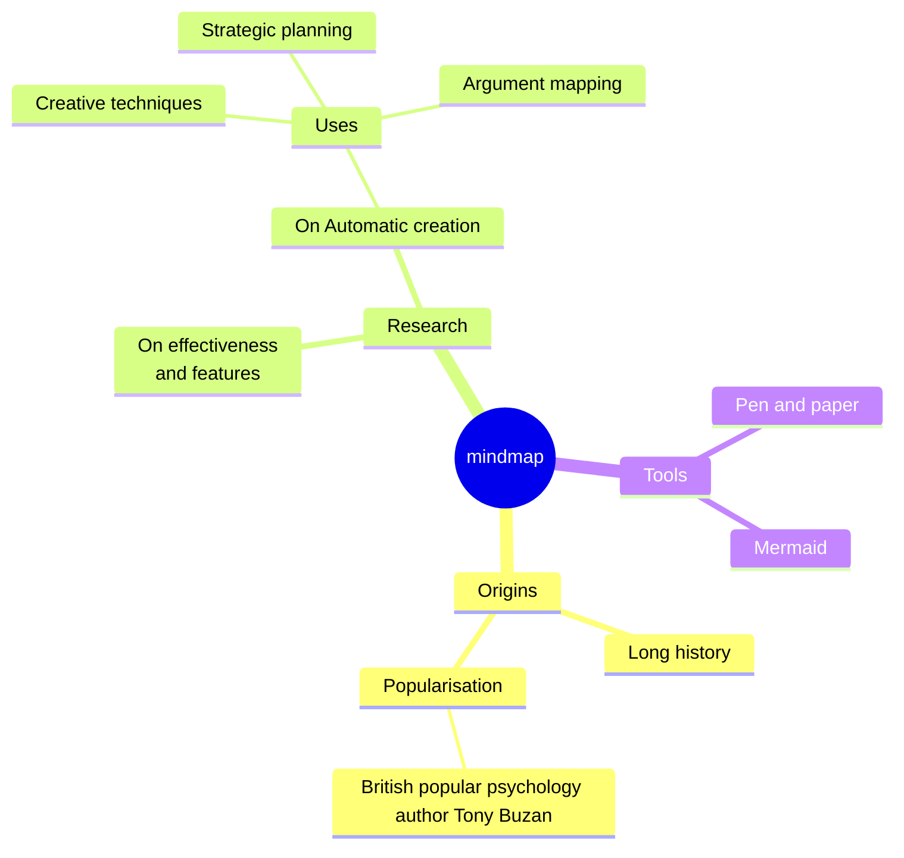
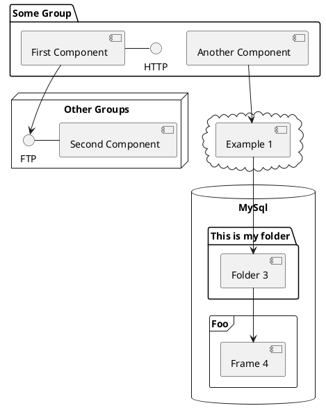

---
# try also 'default' to start simple
theme: seriph
# static background image
background: /78.png
# some information about your slides (markdown enabled)
info: |
  ## AI False Alarm Filtering Technologies
  Technical overview of leading solutions
# apply UnoCSS classes to the current slide
class: title-slide
# glow effect settings
glow: full
glowOpacity: 0.6
glowSeed: 229
# https://sli.dev/features/drawing
drawings:
  persist: false
# slide transition: https://sli.dev/guide/animations.html#slide-transitions
transition: slide-left
# enable MDC Syntax: https://sli.dev/features/mdc
mdc: true
remoteAssets: build 
routerMode: hash 
---

# AI Enabled 
# Alarm Manager

Competitor Analysis

<div @click="$slidev.nav.next" class="navigation-hint" hover:bg="white op-10">
  Press Space for next page <carbon:arrow-right />
</div>

<!--
The last comment block of each slide will be treated as slide notes. It will be visible and editable in Presenter Mode along with the slide. [Read more in the docs](https://sli.dev/guide/syntax.html#notes)
-->

---
transition: fade-out
---

# What is Slidev?

Slidev is a slides maker and presenter designed for developers, consist of the following features 
<SlideContent>


- 📝 **Text-based** - focus on the content with Markdown, and then style them later
- 🎨 **Themable** - themes can be shared and re-used as npm packages
- 🧑‍💻 **Developer Friendly** - code highlighting, live coding with autocompletion
- 🤹 **Interactive** - embed Vue components to enhance your expressions
- 🎥 **Recording** - built-in recording and camera view
- 📤 **Portable** - export to PDF, PPTX, PNGs, or even a hostable SPA
- 🛠 **Hackable** - virtually anything that's possible on a webpage is possible in Slidev
<br>
<br>

Read more about [Why Slidev?](https://sli.dev/guide/why)

<!--
You can have `style` tag in markdown to override the style for the current page.
Learn more: https://sli.dev/features/slide-scope-style
-->

<style>
h1 {
  background-color: #2B90B6;
  background-image: linear-gradient(45deg, #4EC5D4 10%, #146b8c 20%);
  background-size: 100%;
  -webkit-background-clip: text;
  -moz-background-clip: text;
  -webkit-text-fill-color: transparent;
  -moz-text-fill-color: transparent;
}
</style>

<!--
Here is another comment.
-->

</SlideContent>

---
transition: slide-up
glow: bottom
glowOpacity: 0.5
---

<SlideSection
  title="Vue Component Example"
  subtitle="Using data-driven loops instead of copy/paste"
  :title-click-index="1"
  :subtitle-click-index="2"
  :constrain="true"
  padded
>
  <InfoCardV2 
    class="mt-4"
    :items="[
      {
        title: 'pip & uv',
        themeColor: 'warning',
        icon: 'i-logos:python',
        clickIndex: 3,
        description: 'Python package managers for dependency installation',
        pros: ['Fast for Python packages'],
        cons: ['Blind to C++/CUDA deps', 'No system library management', 'Version conflicts common']
      },
      {
        title: 'Docker', 
        themeColor: 'info',
        icon: 'i-devicon:docker',
        clickIndex: 4,
        description: 'Containerization platform for consistent environments',
        pros: ['Reproducible environments'],
        cons: ['Massive image sizes (5-10GB)', 'Slow build times (30+ min)', 'Resource intensive']
      },
      {
        title: 'Nix',
        themeColor: 'primary', 
        icon: 'i-devicon:nixos',
        clickIndex: 5,
        description: 'Functional package manager with reproducible builds',
        pros: ['Complete reproducibility'],
        cons: ['PhD-level learning curve', 'Complex configuration', 'K8s integration challenges']
      }
    ]"
    :dim-click-count="7"
    use-theme-colors
  />

  <template #footer>
    <div class="text-xs opacity-50">Demo of component + structured data loop</div>
  </template>
</SlideSection>

---

# Comparison Example 

Traditional vs Modern Approach

<SlideContent>
<InfoCardV2 
    class="mt-4"
    :items="[
      {
        title: 'pip & uv',
        themeColor: 'warning',
        icon: 'i-logos:python',
        clickIndex: 3,
        description: 'Python package managers for dependency installation',
        pros: ['Fast for Python packages'],
        cons: ['Blind to C++/CUDA deps', 'No system library management', 'Version conflicts common']
      },
      {
        title: 'Docker', 
        themeColor: 'info',
        icon: 'i-devicon:docker',
        clickIndex: 4,
        description: 'Containerization platform for consistent environments',
        pros: ['Reproducible environments'],
        cons: ['Massive image sizes (5-10GB)', 'Slow build times (30+ min)', 'Resource intensive']
      },
      {
        title: 'Nix',
        themeColor: 'primary', 
        icon: 'i-devicon:nixos',
        clickIndex: 5,
        description: 'Functional package manager with reproducible builds',
        pros: ['Complete reproducibility'],
        cons: ['PhD-level learning curve', 'Complex configuration', 'K8s integration challenges']
      }
    ]"
    :dim-click-count="7"
    use-theme-colors
  />
</SlideContent>

---
transition: slide-up
level: 2
---

# Navigation

Hover on the bottom-left corner to see the navigation's controls panel, [learn more](https://sli.dev/guide/ui#navigation-bar)

<SlideContent>

## Keyboard Shortcuts

|                                                     |                             |
| --------------------------------------------------- | --------------------------- |
| <kbd>right</kbd> / <kbd>space</kbd>                 | next animation or slide     |
| <kbd>left</kbd>  / <kbd>shift</kbd><kbd>space</kbd> | previous animation or slide |
| <kbd>up</kbd>                                       | previous slide              |
| <kbd>down</kbd>                                     | next slide                  |

<!-- https://sli.dev/guide/animations.html#click-animation -->

<p v-after class="absolute bottom-23 left-45 opacity-30 transform -rotate-10">Here!</p>
</SlideContent>

---
layout: two-cols
layoutClass: gap-16
---
 
# Table of contents

You can use the `Toc` component to generate a table of contents for your slides:

<SlideContent>

```html
<Toc minDepth="1" maxDepth="1" />
```

The title will be inferred from your slide content, or you can override it with `title` and `level` in your frontmatter.

</SlideContent>

::right::

<Toc text-sm minDepth="1" maxDepth="2" />

---
layout: image-right
image: https://cover.sli.dev
---

<SlideContent>

# Code

Use code snippets and get the highlighting directly, and even types hover!

```ts [filename-example.ts] {all|4|6|6-7|9|all} twoslash
// TwoSlash enables TypeScript hover information
// and errors in markdown code blocks
// More at https://shiki.style/packages/twoslash
import { computed, ref } from 'vue'

const count = ref(0)
const doubled = computed(() => count.value * 2)

doubled.value = 2
```

<arrow v-click="[4, 5]" x1="350" y1="310" x2="195" y2="342" color="#953" width="2" arrowSize="1" />

<!-- This allow you to embed external code blocks -->
<<< @/snippets/external.ts#snippet

<!-- Footer -->

[Learn more](https://sli.dev/features/line-highlighting)

<!-- Inline style -->
<style>
.footnotes-sep {
  @apply mt-5 opacity-10;
}
.footnotes {
  @apply text-sm opacity-75;
}
.footnote-backref {
  display: none;
}
</style>

<!--
Notes can also sync with clicks

[click] This will be highlighted after the first click

[click] Highlighted with `count = ref(0)`

[click:3] Last click (skip two clicks)
-->

</SlideContent>

---
level: 2
---

<SlideContent>

# Shiki Magic Move

Powered by [shiki-magic-move](https://shiki-magic-move.netlify.app/), Slidev supports animations across multiple code snippets.

Add multiple code blocks and wrap them with <code>````md magic-move</code> (four backticks) to enable the magic move. For example:

````md magic-move {lines: true}
```ts {*|2|*}
// step 1
const author = reactive({
  name: 'John Doe',
  books: [
    'Vue 2 - Advanced Guide',
    'Vue 3 - Basic Guide',
    'Vue 4 - The Mystery'
  ]
})
```

```ts {*|1-2|3-4|3-4,8}
// step 2
export default {
  data() {
    return {
      author: {
        name: 'John Doe',
        books: [
          'Vue 2 - Advanced Guide',
          'Vue 3 - Basic Guide',
          'Vue 4 - The Mystery'
        ]
      }
    }
  }
}
```

```ts
// step 3
export default {
  data: () => ({
    author: {
      name: 'John Doe',
      books: [
        'Vue 2 - Advanced Guide',
        'Vue 3 - Basic Guide',
        'Vue 4 - The Mystery'
      ]
    }
  })
}
```

Non-code blocks are ignored.

```vue
<!-- step 4 -->
<script setup>
const author = {
  name: 'John Doe',
  books: [
    'Vue 2 - Advanced Guide',
    'Vue 3 - Basic Guide',
    'Vue 4 - The Mystery'
  ]
}
</script>
```
````

</SlideContent>

---

<SlideContent>

# Components

<div grid="~ cols-2 gap-4">
<div>

You can use Vue components directly inside your slides.

We have provided a few built-in components like `<Tweet/>` and `<Youtube/>` that you can use directly. And adding your custom components is also super easy.

```html
<Counter :count="10" />
```

<!-- ./components/Counter.vue -->
<Counter :count="10" m="t-4" />

Check out [the guides](https://sli.dev/builtin/components.html) for more.

 </div>
<div>

```html
<Tweet id="1390115482657726468" />
```

<Tweet id="1390115482657726468" scale="0.65" />

</div>
</div>

<!--
Presenter note with **bold**, *italic*, and ~~striked~~ text.

Also, HTML elements are valid:
<div class="flex w-full">
  <span style="flex-grow: 1;">Left content</span>
  <span>Right content</span>
</div>
-->

</SlideContent>

---
class: px-20
---

<SlideContent>

# Themes

Slidev comes with powerful theming support. Themes can provide styles, layouts, components, or even configurations for tools. Switching between themes by just **one edit** in your frontmatter:

<div grid="~ cols-2 gap-2" m="t-2">

```yaml
---
theme: default
---
```

```yaml
---
theme: seriph
---
```


</div>

Read more about [How to use a theme](https://sli.dev/guide/theme-addon#use-theme) and
check out the [Awesome Themes Gallery](https://sli.dev/resources/theme-gallery).

</SlideContent>


<SlideContent>

# Clicks Animations

You can add `v-click` to elements to add a click animation.

<div v-click>

This shows up when you click the slide:

```html
<div v-click>This shows up when you click the slide.</div>
```

</div>

<br>

<v-click>

The <span v-mark.red="3"><code>v-mark</code> directive</span>
also allows you to add
<span v-mark.circle.orange="4">inline marks</span>
, powered by [Rough Notation](https://roughnotation.com/):

```html
<span v-mark.underline.orange>inline markers</span>
```

</v-click>

<div mt-20 v-click>

[Learn more](https://sli.dev/guide/animations#click-animation)

 </div>

</SlideContent>

---

<SlideContent>

# Clicks Animations


You can add `v-click` to elements to add a click animation.

<div v-click>

This shows up when you click the slide:

```html
<div v-click>This shows up when you click the slide.</div>
```

</div>

<br>

<v-click>

The <span v-mark.red="3"><code>v-mark</code> directive</span>
also allows you to add
<span v-mark.circle.orange="4">inline marks</span>
, powered by [Rough Notation](https://roughnotation.com/):

```html
<span v-mark.underline.orange>inline markers</span>
```

</v-click>

<div mt-20 v-click>

[Learn more](https://sli.dev/guide/animations#click-animation)

 </div>

</SlideContent>

---

<SlideContent>

# Clicks Animations


You can add `v-click` to elements to add a click animation.

<div v-click>

This shows up when you click the slide:

```html
<div v-click>This shows up when you click the slide.</div>
```

</div>

<br>

<v-click>

The <span v-mark.red="3"><code>v-mark</code> directive</span>
also allows you to add
<span v-mark.circle.orange="4">inline marks</span>
, powered by [Rough Notation](https://roughnotation.com/):

```html
<span v-mark.underline.orange>inline markers</span>
```

</v-click>

<div mt-20 v-click>

[Learn more](https://sli.dev/guide/animations#click-animation)

 </div>

</SlideContent>

---

<SlideContent>

# Clicks Animations


You can add `v-click` to elements to add a click animation.

<div v-click>

This shows up when you click the slide:

```html
<div v-click>This shows up when you click the slide.</div>
```

</div>

<br>

<v-click>

The <span v-mark.red="3"><code>v-mark</code> directive</span>
also allows you to add
<span v-mark.circle.orange="4">inline marks</span>
, powered by [Rough Notation](https://roughnotation.com/):

```html
<span v-mark.underline.orange>inline markers</span>
```

</v-click>

<div mt-20 v-click>

[Learn more](https://sli.dev/guide/animations#click-animation)

 </div>

</SlideContent>

---

<SlideContent>

# Clicks Animations


You can add `v-click` to elements to add a click animation.

<div v-click>

This shows up when you click the slide:

```html
<div v-click>This shows up when you click the slide.</div>
```

</div>

<br>

<v-click>

The <span v-mark.red="3"><code>v-mark</code> directive</span>
also allows you to add
<span v-mark.circle.orange="4">inline marks</span>
, powered by [Rough Notation](https://roughnotation.com/):

```html
<span v-mark.underline.orange>inline markers</span>
```

</v-click>

<div mt-20 v-click>

[Learn more](https://sli.dev/guide/animations#click-animation)

 </div>

</SlideContent>

---

<SlideContent>

# Clicks Animations


You can add `v-click` to elements to add a click animation.

<div v-click>

This shows up when you click the slide:

```html
<div v-click>This shows up when you click the slide.</div>
```

</div>

<br>

<v-click>

The <span v-mark.red="3"><code>v-mark</code> directive</span>
also allows you to add
<span v-mark.circle.orange="4">inline marks</span>
, powered by [Rough Notation](https://roughnotation.com/):

```html
<span v-mark.underline.orange>inline markers</span>
```

</v-click>

<div mt-20 v-click>

[Learn more](https://sli.dev/guide/animations#click-animation)

 </div>

</SlideContent>

---

<SlideContent>

# Clicks Animations


You can add `v-click` to elements to add a click animation.

<div v-click>

This shows up when you click the slide:

```html
<div v-click>This shows up when you click the slide.</div>
```

</div>

<br>

<v-click>

The <span v-mark.red="3"><code>v-mark</code> directive</span>
also allows you to add
<span v-mark.circle.orange="4">inline marks</span>
, powered by [Rough Notation](https://roughnotation.com/):

```html
<span v-mark.underline.orange>inline markers</span>
```

</v-click>

<div mt-20 v-click>

[Learn more](https://sli.dev/guide/animations#click-animation)

 </div>

</SlideContent>

---

<SlideContent>

# Motions

Motion animations are powered by [@vueuse/motion](https://motion.vueuse.org/), triggered by `v-motion` directive.

```html
<div
  v-motion
  :initial="{ x: -80 }"
  :enter="{ x: 0 }"
  :click-3="{ x: 80 }"
  :leave="{ x: 1000 }"
>
  Slidev
</div>
```

<div class="w-60 relative">
  <div class="relative w-40 h-40">
    
    
    
  </div>

  <div
    class="text-5xl absolute top-14 left-40 text-[#2B90B6] -z-1"
    v-motion
    :initial="{ x: -80, opacity: 0}"
    :enter="{ x: 0, opacity: 1, transition: { delay: 2000, duration: 1000 } }">
    Slidev
  </div>
</div>

<!-- vue script setup scripts can be directly used in markdown, and will only affects current page -->
<script setup lang="ts">
const final = {
  x: 0,
  y: 0,
  rotate: 0,
  scale: 1,
  transition: {
    type: 'spring',
    damping: 10,
    stiffness: 20,
    mass: 2
  }
}
</script>

<div
  v-motion
  :initial="{ x:35, y: 30, opacity: 0}"
  :enter="{ y: 0, opacity: 1, transition: { delay: 3500 } }">

[Learn more](https://sli.dev/guide/animations.html#motion)

 </div>

</SlideContent>

---

<SlideContent>

# LaTeX

LaTeX is supported out-of-box. Powered by [KaTeX](https://katex.org/).

<div h-3 />

Inline $\sqrt{3x-1}+(1+x)^2$

Block
$$ {1|3|all}
\begin{aligned}
\nabla \cdot \vec{E} &= \frac{\rho}{\varepsilon_0} \\
\nabla \cdot \vec{B} &= 0 \\
\nabla \times \vec{E} &= -\frac{\partial\vec{B}}{\partial t} \\
\nabla \times \vec{B} &= \mu_0\vec{J} + \mu_0\varepsilon_0\frac{\partial\vec{E}}{\partial t}
\end{aligned}
$$

[Learn more](https://sli.dev/features/latex)

</SlideContent>

---

<SlideContent>

# Diagrams

You can create diagrams / graphs from textual descriptions, directly in your Markdown.

<div class="grid grid-cols-4 gap-5 pt-4 -mb-6">









</div>

Learn more: [Mermaid Diagrams](https://sli.dev/features/mermaid) and [PlantUML Diagrams](https://sli.dev/features/plantuml)

</SlideContent>

---
foo: bar
dragPos:
  square: 0,-124,0,0
---

<SlideContent>

# Draggable Elements

Double-click on the draggable elements to edit their positions.

<br>

###### Directive Usage

```md

```

<br>

###### Component Usage

```md
<v-drag text-3xl>
  <div class="i-carbon:arrow-up" />
  Use the `v-drag` component to have a draggable container!
</v-drag>
```

<v-drag pos="682,52,261,_,-15">
  <div text-center text-3xl border border-main rounded>
    Double-click me!
  </div>
</v-drag>


###### Draggable Arrow

```md
<v-drag-arrow two-way />
```

<v-drag-arrow pos="67,452,253,46" two-way op70 />

</SlideContent>

---
src: ./pages/imported-slides.md
hide: false
---

---

<SlideContent>

# Monaco Editor

Slidev provides built-in Monaco Editor support.

Add `{monaco}` to the code block to turn it into an editor:

```ts {monaco}
import { ref } from 'vue'
import { emptyArray } from './external'

const arr = ref(emptyArray(10))
```

Use `{monaco-run}` to create an editor that can execute the code directly in the slide:

```ts {monaco-run}
import { version } from 'vue'
import { emptyArray, sayHello } from './external'

sayHello()
console.log(`vue ${version}`)
console.log(emptyArray<number>(10).reduce(fib => [...fib, fib.at(-1)! + fib.at(-2)!], [1, 1]))
```

</SlideContent>

---
layout: center
class: text-center
---

<SlideContent>

# Learn More

[Documentation](https://sli.dev) · [GitHub](https://github.com/slidevjs/slidev) · [Showcases](https://sli.dev/resources/showcases)

<PoweredBySlidev mt-10 />

</SlideContent>

---
src: ./pages/otherslide.md
---

---
src: ./pages/mission-vision.md
---

---
layout: default
---

# Definitions
Understanding the Landscape

<SlideContent :padded="false" :bottom-gap="10">

<InfoCardV2 
  :columns="3"
  :compact="true"
  :items="[
    {
      title: 'SCADA',
      themeColor: 'warning',
      icon: 'i-carbon:industry',
      description: 'Supervisory Control & Data Acquisition',
      customContent: `<div class='text-center py-4'>
        <div class='text-6xl mb-4'>🏭</div>
        <p class='text-xs opacity-80'>Industrial Control Systems</p>
      </div>`
    },
    {
      title: 'GSOC',
      themeColor: 'primary',
      icon: 'i-carbon:globe',
      description: 'Global Security Operations Center',
      customContent: `<div class='text-center py-4'>
        <div class='text-6xl mb-4'>🌐</div>
        <p class='text-xs opacity-80'>24/7 Centralized Security Hub</p>
      </div>`
    },
    {
      title: 'PSIM',
      themeColor: 'accent',
      icon: 'i-carbon:star',
      description: 'Physical Security Information Management',
      customContent: `<div class='text-center py-4'>
        <div class='text-6xl mb-4'>⭐</div>
        <p class='text-xs opacity-80'>Unified Security Interface</p>
      </div>`
    },
    {
      title: 'VMS',
      themeColor: 'success',
      icon: 'i-carbon:video',
      description: 'Video Management System',
      customContent: `<div class='text-center py-4'>
        <div class='text-6xl mb-4'>📹</div>
        <p class='text-xs opacity-80'>Video Recording & Analytics</p>
      </div>`
    },
    {
      title: 'PACS',
      themeColor: 'secondary',
      icon: 'i-carbon:locked',
      description: 'Physical Access Control System',
      customContent: `<div class='text-center py-4'>
        <div class='text-6xl mb-4'>🔒</div>
        <p class='text-xs opacity-80'>Door & Entry Management</p>
      </div>`
    }
  ]"
/>

</SlideContent>

---
layout: default
---

# New Product Ideas to Products - PM

<div class="stacked-boxes-container">


  <div class="stacked-box box-2" v-click="2">
    <h3>Emerging Products</h3>
    <p>Commersialization and Scaling</p>
  </div>
    
  <div class="stacked-box box-3" v-click="3">
    <h3>Mature Product</h3>
    <p>Optimization + Market Leadership</p>
  </div>
  
  <div class="stacked-box box-1" v-click="1">
    <h3>Emerging AI</h3>
    <p>Ideas to MVP</p>
  </div>
  
  <!-- Curly bracket and Louise label -->
  <div class="bracket-label" v-click="1">
    <div class="curly-bracket">}</div>
    <div class="label-text">Louise</div>
  </div>
  
  <!-- Product Ideas Icon and Arrow -->
  <div class="product-ideas-section" v-click="4">
    <div class="product-ideas-icon">
      <div class="icon-circle">
        💡
      </div>
      <span class="icon-label">New Product Ideas</span>
    </div>
    <div class="arrow-to-box">
      <svg class="arrow-svg" viewBox="0 0 100 20">
        <defs>
          <marker id="arrowhead" markerWidth="10" markerHeight="7" refX="10" refY="3.5" orient="auto">
            <polygon points="0 0, 10 3.5, 0 7" fill="#ffffff" opacity="0.8" />
          </marker>
        </defs>
        <line x1="0" y1="10" x2="90" y2="10" stroke="#ffffff" stroke-width="2" marker-end="url(#arrowhead)" opacity="0.8" />
      </svg>
    </div>
  </div>
 
</div>

<style scoped>
.stacked-boxes-container {
  position: relative;
  height: 300px;
  width: 100%;
  margin: 2rem auto;
  max-width: 900px;
  display: flex;
  align-items: center;
  justify-content: center;
}

.stacked-box {
  position: absolute;
  width: 250px;
  height: 120px;
  padding: 1.2rem;
  border-radius: 12px;
  box-shadow: 0 8px 32px rgba(0, 0, 0, 0.3);
  backdrop-filter: blur(10px);
  border: 1px solid rgba(255, 255, 255, 0.2);
  transition: all 0.5s ease;
  display: flex;
  flex-direction: column;
  justify-content: center;
  text-align: left;
}

.box-1 {
  top: 260px;
  left: 350px;
  background: linear-gradient(135deg, rgba(59, 130, 246, 0.95), rgba(37, 99, 235, 0.85));
  z-index: 1;
}

.box-2 {
  top: 130px;
  left: 500px;
  background: linear-gradient(135deg, rgba(16, 185, 129, 0.95), rgba(5, 150, 105, 0.85));
  z-index: 2;
}

.box-3 {
  top: 0px;
  left: 650px;
  background: linear-gradient(135deg, rgba(245, 158, 11, 0.95), rgba(217, 119, 6, 0.85));
  z-index: 3;
}

.stacked-box h3 {
  font-size: 0.9rem;
  font-weight: 700;
  color: white;
  margin-bottom: 0.2rem;
  text-shadow: 0 2px 4px rgba(0, 0, 0, 0.3);
}

.stacked-box p {
  font-size: 0.75rem;
  color: rgba(255, 255, 255, 0.9);
  line-height: 1.3;
  text-shadow: 0 1px 2px rgba(0, 0, 0, 0.2);
  margin-top: 0;
  margin-bottom: 0;
}

.stacked-box:hover {
  transform: translateY(-5px);
  box-shadow: 0 12px 40px rgba(0, 0, 0, 0.4);
}

/* Curly bracket and label styling */
.bracket-label {
  position: absolute;
  top: 375px;
  left: 350px;
  display: flex;
  flex-direction: column;
  align-items: center;
  z-index: 5;
}

.curly-bracket {
  font-size: 2rem;
  color: rgba(255, 255, 255, 0.8);
  font-weight: bold;
  transform: rotate(90deg) scaleX(1) scaleY(5);
  text-shadow: 0 2px 4px rgba(0, 0, 0, 0.3);
  width: 250px;
  text-align: center;
  margin-bottom: -10px;
}

.label-text {
  font-size: 1rem;
  color: rgba(255, 255, 255, 0.9);
  font-weight: 600;
  text-shadow: 0 1px 2px rgba(0, 0, 0, 0.3);
  margin-top: 0px;
}

/* Product Ideas Icon and Arrow */
.product-ideas-section {
  position: absolute;
  top: 290px;
  left: 50px;
  display: flex;
  align-items: center;
  gap: 20px;
  z-index: 10;
}

.product-ideas-icon {
  display: flex;
  flex-direction: column;
  align-items: center;
  gap: 8px;
}

.icon-circle {
  width: 60px;
  height: 60px;
  background: linear-gradient(135deg, rgba(255, 193, 7, 0.9), rgba(255, 152, 0, 0.8));
  border-radius: 50%;
  display: flex;
  align-items: center;
  justify-content: center;
  font-size: 24px;
  box-shadow: 0 4px 15px rgba(0, 0, 0, 0.2);
  border: 2px solid rgba(255, 255, 255, 0.3);
}

.icon-label {
  font-size: 0.85rem;
  font-weight: 600;
  color: white;
  text-align: center;
  white-space: nowrap;
  text-shadow: 0 1px 2px rgba(0, 0, 0, 0.3);
}

.arrow-to-box {
  width: 120px;
  height: 20px;
}

.arrow-svg {
  width: 100%;
  height: 100%;
}

.product-ideas-section {
  animation: slide-in-left 0.6s ease-out;
}

@keyframes slide-in-left {
  0% {
    opacity: 0;
    transform: translateX(-30px);
  }
  100% {
    opacity: 1;
    transform: translateX(0);
  }
}
</style>

---
layout: default
---

<SlideContent>

# Product Management Ownership

<InfoCardV2 
  :columns="3"
  :compact="true"
  :items="[
    {
      title: '🤖 Emerging AI',
      themeColor: 'info',
      customContent: `<div class='p-4'>
        <div class='role-item ownership mb-3'>
          <div class='role-label'>⭐ Ownership:</div>
          <div class='person-name'>Louise</div>
        </div>
        <div class='role-item contributor'>
          <div class='role-label'>🤝 Contributor:</div>
          <div class='person-name'>Hao</div>
        </div>
      </div>`
    },
    {
      title: '🚀 Emerging Products',
      themeColor: 'secondary',
      customContent: `<div class='p-4'>
        <div class='role-item ownership mb-3'>
          <div class='role-label'>⭐ Ownership:</div>
          <div class='person-name'>Hao</div>
        </div>
        <div class='role-item contributor'>
          <div class='role-label'>🤝 Contributor:</div>
          <div class='person-name'>Louise</div>
        </div>
      </div>`
    },
    {
      title: '📈 Products',
      themeColor: 'primary',
      customContent: `<div class='p-4'>
        <div class='role-item ownership mb-3'>
          <div class='role-label'>⭐ Ownership:</div>
          <div class='person-name'>Product Management</div>
        </div>
        <div class='role-item contributor'>
          <div class='role-label'>🤝 Contributor:</div>
          <div class='person-name'>Hao, (Louise if feature to existing product)</div>
        </div>
      </div>`
    }
  ]"
/>

</SlideContent>


<style>
.role-item {
  display: flex;
  align-items: center;
  gap: 0.75rem;
  padding: 0.5rem 0.75rem;
  background: rgba(255, 255, 255, 0.1);
  border-radius: 8px;
  border-left: 4px solid rgba(255, 255, 255, 0.4);
}

.ownership {
  border-left-color: #fbbf24;
}

.contributor {
  border-left-color: #60a5fa;
}

.role-label {
  font-weight: 600;
  color: rgba(255, 255, 255, 0.8);
  min-width: 90px;
  font-size: 0.85rem;
}

.person-name {
  font-weight: 700;
  font-size: 0.9rem;
  color: white;
  text-shadow: 0 1px 2px rgba(0, 0, 0, 0.2);
}
</style>

---
src: ./pages/2ndslide.md
---

---
src: ./pages/motion-detection-slides/01-epics.md
---
---
src: ./pages/motion-detection-slides/02-epic1.md
---
---
src: ./pages/motion-detection-slides/04-epic3.md
---
---
src: ./pages/motion-detection-slides/05-epic4.md
---
---
src: ./pages/motion-detection-slides/06-epic5.md
---
---
src: ./pages/motion-detection-slides/07-epic6.md
---
---
src: ./pages/motion-detection-slides/08-epic7.md
---
---
src: ./pages/motion-detection-slides/09-epic8.md
---
---
src: ./pages/motion-detection-slides/10-checklist.md
---
---
src: ./pages/motion-detection-slides/10a-checklist-core.md
---
src: ./pages/motion-detection-slides/10a2-checklist-ux.md
---
src: ./pages/motion-detection-slides/10b-checklist-benchmarking.md
---
src: ./pages/motion-detection-slides/10c-checklist-performance.md
---
